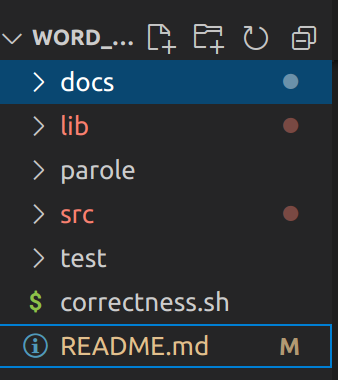
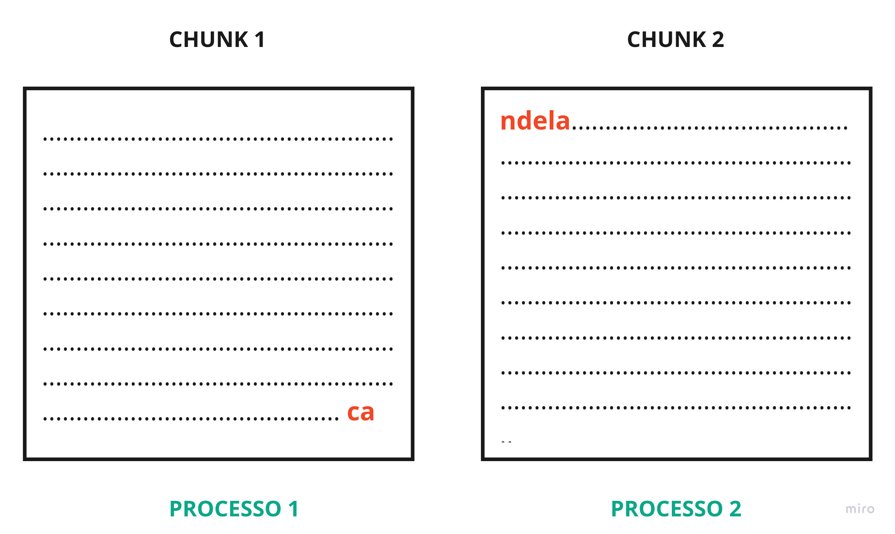
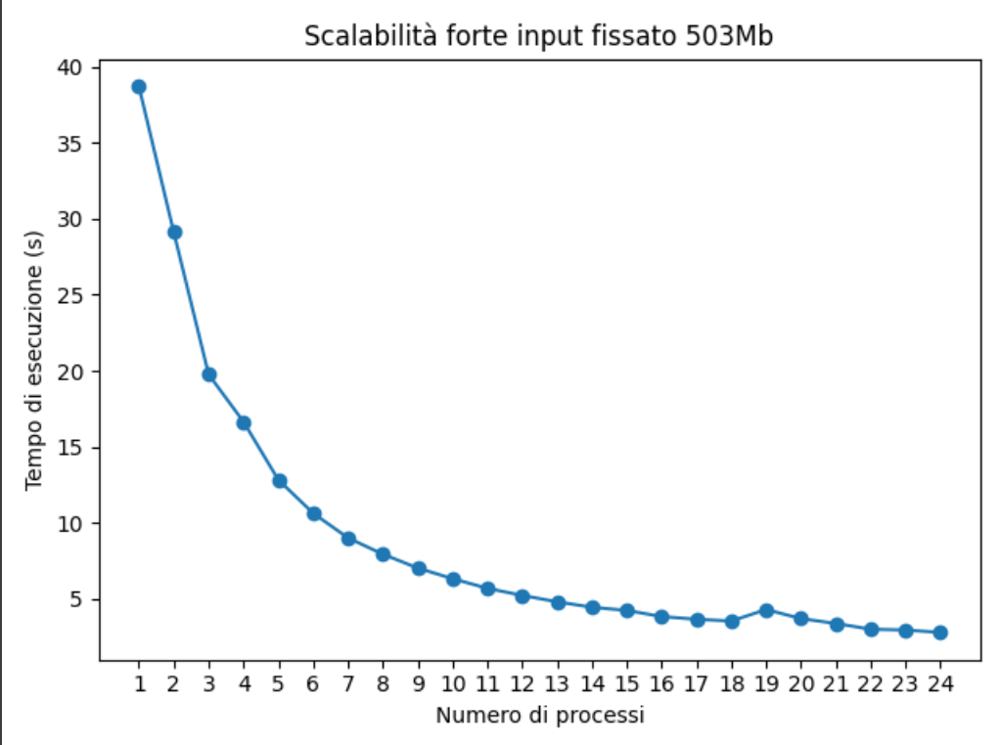
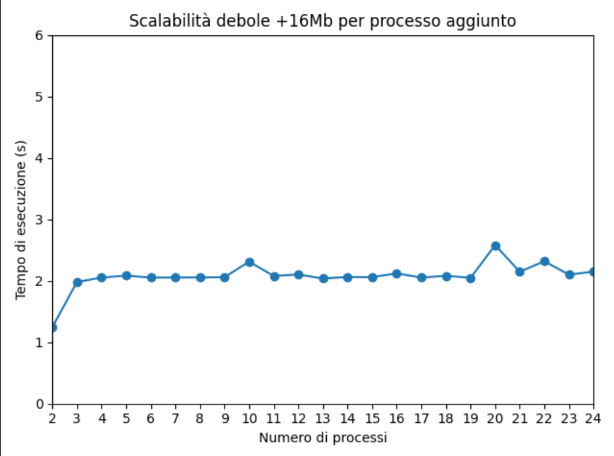
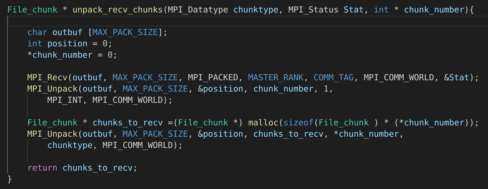
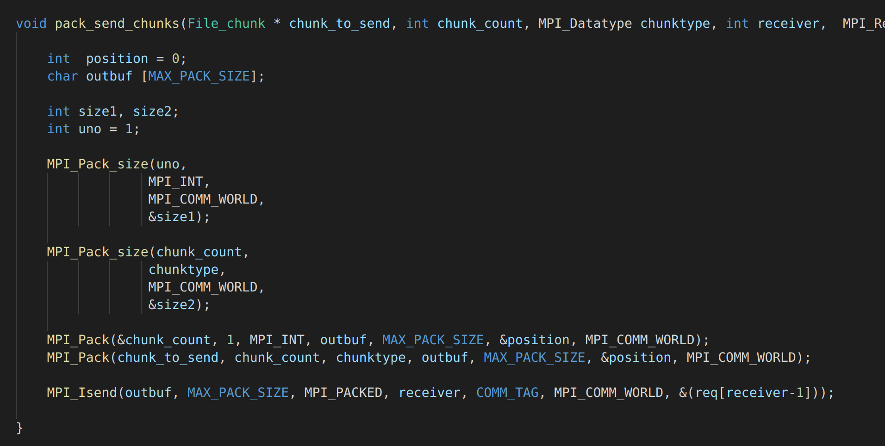

# :a: Word_Count_MPI

Word_Count_MPI è un'implementazione parallela di word count per il conteggio delle parole. Il conteggio delle parole è una pratica molto diffusa, soprattutto quando un testo deve rimanere entro un numero specifico di parole.

## Descrizione del problema

Il problema deve essere risolto con una versione di map-reduce usando MPI. L'obiettivo è quello di eseguire velocemente il conteggio delle parole su un gran numero di file:

Il MASTER dovrà leggere tutti i file all'interno di una directory. Ognuno degli altri processi dovrà ricevere la propria porzione sul totale di tutti i file dal processo MASTER. Una volta che un processo ha ricevuto la propria porzione dovrà effettuare su di essa un conteggio delle parole, per tenere traccia della frequenza di ogni parola trovata.
Tutti i processi svilupperanno un istogramma locale, le frequenze elaborate da ogni processo dovranno poi essere unite dal MASTER che ricevendo gli istogrammi da ognuno dei processi SLAVE dovrà unirli. Infine, il master produrrà un file CSV contenente le frequenze ordinate.

## Soluzione del problema

L'aspetto più complicato del problema è quello di dividere in maniera equa la computazione tra i processi. 

L'algoritmo opera come segue:

1. Il processo MASTER riceve in input da linea di comando una cartella contenete tutti i file sui quali effettuare il conteggio delle parole.

2. Il processo MASTER divide i file in maniera equa considerando la loro grandezza in byte (evitando quindi di scorrerli per effettuare la divisione). Invia ad ogni processo una o più partizioni, come quella descritta di seguito: 

    


    - IL campo **FILE** indica a quale file appartiene la partizione. 
    - Il campo **BYTE DI INIZIO** indica il byte all'interno del file da cui la partizione inizia.
    - Il campo **BYTE DI FINE** indica il byte all'interno del file in cui la partizione finisce.

Ogni processo riceve un numero variabile di partizioni di dimensioni diverse ma, ogni processo lavora su un totale di byte uguale a quello degli altri. La somma delle dimensioni delle partizioni ricevute sarà uguale per ogni processo. 

3. I processi SLAVE ricevono la propria porzione ed inziano ad effettuare il conteggio delle parole, contandone la frequenza. 

4. Le frequenze calcolate sono inviate dagli SLAVE al MASTER.

5. IL MASTER riceve le frequenze da tutti gli altri processi unendole. Per concludere produce un file csv con all'interno il conteggio esatto delle parole. 

## Struttura del progetto



- la directory **docs** contiene tutte le immagini ed i file utili per la documentazione.
- la directory **lib** contiene tutti gli header
- la directory **src** contiene tutte i file .c, il makefile per la compilazione ed l'install.sh
- le directory **parole** e **test** sono due directory utilizzate per il testing del programma durante la fase di sviluppo e durante le fasi successive.
- lo scirpt **correctness.sh** è uno script utilizzato per provare la correttezza dell'applicativo. 

## Input del programma

Il programma accetta in input una cartella non vuota contenente i file sui quali effettuare il conteggio.
I file possono contenere del testo normale, non è richiesta una formattazione particolare delle parole all'interno del file.

Esempio : 

>Poi ricordo che un giorno mio padre mi sorprese col suo panciotto in mano. Io, con una
>sfacciataggine che ora non avrei e che ancora adesso mi disgusta (chissà che tale
>disgusto non abbia una grande importanza nella mia cura) gli dissi che m’era venuta la
>curiosità di contarne i bottoni. Mio padre rise delle mie disposizioni alla matematica o alla
>sartoria e non s’avvide che avevo le dita nel taschino del suo panciotto.

## Output del programma

L'output del programma sarà il file "output.txt" contenente la lista delle parole contate e il numero di volte che sono state contate.

Per parola si intende una sequenza di massimo 46 caratteri terminata da uno spazio, un carriage return o un tab.

## Dettagli implementativi

### Input

Come già detto precedentemente il programma prende in input, al momento dell'esecuzione, come parametro una cartella contenente tutti i file sui quali deve essere effettuato il conteggio delle parole.
La cartella deve contenere almeno un file altrimenti il programma mostrerà un messaggio d'errore.

### Divisione dei File

I file vengono divisi dal MASTER in partizioni che chiameremo chunk.
Il master ottiene la dimensione in byte di ogni file attraverso l'istruzione: 

```
File_inf * get_file_info(char * file_path){
    struct stat sb;
    File_inf * file = (File_inf *) malloc(sizeof(File_inf));

    if(stat(file_path, &sb) != -1){
        file->total_size = sb.st_size;
        file->path = malloc(sizeof(char) * strlen(file_path) + 1);
        strncpy(file->path ,file_path , strlen(file_path)+1);
    }

    return file;  
}
```

Sommando la dimensione di ogni file, ottiene la taglia totale dell'input da dividere tra i processi.
Dividendo la taglia totale per il numero di processi SLAVE, viene calcolato il numero di byte da distribuire per ogni processo. Quando la taglia totale non è un multiplo del numero di SLAVE, ci sono dei byte ulteriori da distribuire. Questi byte ulteriori vengono, per semplicità algortmica, assegnati tutti all'ultimo processo.

```
int temp = total_size / (numtasks-1);
```

Una volta calcolati i byte da assegnare ad ogni processo, il MASTER produce i chunk rappresentati dalla seguente struct: 

```
typedef struct File_chunk{

    double start_offset;
    double end_offset;
    char path[260];
    
} File_chunk;
```
Per ogni processo SLAVE, calcola i chunk e li memorizza all'interno di un array.

### Invio dei chunk

Il master procede in ordine di rank nel calcolo dei chunk. Ad esempio, supponiamo di avere tre processi SLAVE, allora il MASTER calcolerà prima i chunk per il processo 1, poi quelli per il processo 2 ed infine quelli per il processo 3.

L'invio dei chunk avviene in maniera asincrona con la funzione Isend.

```
MPI_Isend(chunks_to_send[task_to_assign - 1], chunk_count, chunktype, task_to_assign, COMM_TAG,            
            MPI_COMM_WORLD, &(reqs[task_to_assign-1]));
```
Questo meccanismo di invio è stato scelto perchè permette di iniziare l'invio dei chunk ad un processo senza aspettare che la ricezione venga completata. In questo modo il MASTER può continuare il calcolo dei chunk per i restanti processi senza fermarsi.

La documentazione raccomanda di non modificare il buffer inviato finchè non si è sicuri che l'operazione di invio sia stata completata.

>"The sender should not modify any part of the send buffer after a nonblocking send operation is called,   
>until the send completes" 

Per questo motivo per ogni SLAVE viene allocato un apposito buffer.

Una volta inviati tutti i chunk, il MASTER attende che tutte le operazioni di invio siano completate. A questo punto può deallocare tutti buffer che non servono più e che sono stati allocati dinamicamente.

```
MPI_Waitall(numtasks - 1, reqs , MPI_STATUSES_IGNORE);

free(reqs);
for(int i = 0; i< numtasks -1; i++){
    free(chunks_to_send[i]);
}
free(chunks_to_send);
free_files_info(files, file_nums);
```

### Ricezione dei chunk

Ogni processo riceve un array di chunk dal master sui quali compiere il proprio lavoro di conteggio : 

```
File_chunk * probe_recv_chunks(MPI_Datatype chunktype, MPI_Status Stat, int * chunk_number){

    *chunk_number = 0;
    MPI_Probe(MASTER_RANK, COMM_TAG, MPI_COMM_WORLD, &Stat);
    MPI_Get_count(&Stat, chunktype, chunk_number);
    File_chunk * chunks_to_recv =(File_chunk *) malloc(sizeof(File_chunk ) * (*chunk_number));
    MPI_Recv(chunks_to_recv, *chunk_number, chunktype, MASTER_RANK, COMM_TAG, MPI_COMM_WORLD, &Stat);
    return chunks_to_recv;
}
```
Il processo SLAVE che riceve il messaggio non conosce la grandezza del buffer inviato, questa informazione è fondamentale per l'allocazione di un buffer di ricezione grande esattamente come quello inviato dal MASTER, in modo tale da non avere spreco di memoria.

Per allocare con precisione, ogni processo SLAVE:

1. Controlla il messaggio in arrivo, senza riceverlo effettivamente grazie alla funzione MPI_Probe (funzione bloccante).
2. In base alle informazioni restituite dalla sonda nella variabile di stato, il processo può ottenere il numero di elementi presenti all'interno dell'array inviato.
3. Finalmente può allocare memoria per il buffer di ricezione, in base alla lunghezza del messaggio sondato.


### Conteggio all'interno dei chunk

Una volta ricevuti i propri chunk, ogni processo inizia il conteggio preoccupandosi solo delle parole all'interno della porzione di file descritta da ogni chunk.
Processi diversi possono ricevere chunk diversi ma che dividono lo stesso file. Siccome i chunk sono calcolati solo sulla base delle dimensioni, può accadere che una parola sia spezzata tra due chunk.




Questo problema è stato risolto evitando comunicazioni ulteriori tra i processi, le quali introdurrebbero un importante overhead.
Ogni processo è libero di andare oltre la fine del proprio chunk per completare la lettura della parola.
Nell'esempio in figura, il processo 1 continuerà la lettura della parola "candela" lavorando su un piccolo pezzo del chunk destinato al processo 2.
Il processo 2 invece, ha bisogno di capire se "ndela" è parte di una parola iniziata in un altro chunk oppure è una parola appena iniziata. In questo esempio per non contare "ndela" come una parola, ha bisogno di "sbirciare" gli ultimi byte del chunk 1.

Una volta indivuato un lessema, questo viene contato servendosi di una hashtable che utilizza come chiave il lessema e come valore il conteggio del lessema. 
L'inserimento ed il lookup in una hashtable ha complessità temporale O(1), questo rende il conteggio più rapido possibile.

```
lookup = g_hash_table_lookup(hash,lexeme);
if(lookup == NULL){
    val = 1;    
}
else{
    val = GPOINTER_TO_INT(lookup) + 1;
}
g_hash_table_insert(hash,lexeme,GINT_TO_POINTER (val));
```

### Invio dell'istogramma locale

Ogni processo a partire dalla propria hashtable locale crea un array di struct Word_Occurrence :

```
typedef struct Word_occurrence{

    int num;
    char word[46];

} Word_occurrence;
```
La struttura descrive l'occorrenza di una parola, il campo num identifica il numero di volte che il lessema contenuto all'interno dell'array word è stato contato.
Ogni processo SLAVE per ogni entry dell'hashtable crea una Word_occurrence e le organizza all'interno di un array.

Questo array sarà inviato al MASTER tramite la funzione MPI_Send.

```
MPI_Send(occurrences, num_occ, wordtype, 0, COMM_TAG, MPI_COMM_WORLD);
```

In questo caso si è scelto di utlizzare la Send, perchè non è importante che il figlio continui l'esecuzione senza fermarsi in quanto l'invio è l'ultima operazione che viene svolta.

### Ricezione degli istogrammi locali

Il main dopo aver distribuito in maniera equa il carico di lavoro, attende che i processi SLAVE inviino il risultato della computazione come visto precedentemente.
Seppur lavorando con lo stesso carico di lavoro, ci saranno dei processi più veloci e dei processi più lenti.
Proprio per questo motivo il MASTER non può attendere la risposta in ordine di come ha distribuito i chunk.

```
for(int i = 0; i < numtasks -1; i++){  

    MPI_Probe(MPI_ANY_SOURCE, COMM_TAG, MPI_COMM_WORLD, &stat);
    MPI_Get_count(&stat, wordtype, &words_in_message);
    occurrences = malloc(sizeof(Word_occurrence ) * words_in_message);
    MPI_Recv(occurrences, words_in_message, wordtype, stat.MPI_SOURCE, COMM_TAG, MPI_COMM_WORLD, &stat);
    for(int j=0; j< words_in_message; j++){
        lookup = g_hash_table_lookup(hash,occurrences[j].word);
        if(lookup == NULL){
                g_hash_table_insert(hash,occurrences[j].word,GINT_TO_POINTER (occurrences[j].num));
            }
        else{
            g_hash_table_insert(hash,occurrences[j].word,
                                GINT_TO_POINTER (occurrences[j].num + GPOINTER_TO_INT(lookup)));
            }
        } 

    }
```

Grazie alla wildcard MPI_ANY_SOURCE il processo MASTER si mette in attesa di un messaggio in arrivo da qualsiasi processo senza riceverlo.
Interrogando lo STATUS con la funzione MPI_Get_Count ottiene il numero di Word_occurence in arrivo ed istanzia un buffer di dimensione precisa.
Sempre grazie allo STATUS ottiene il mittente del messaggio, a partire da queste informazioni può ricevere l'array di Word_occurrence. 

Il merge degli istogrammi avviene in ordine di ricezione ad esempio, se il terzo processo è il primo ad inviare i risultati della sua computazione al MASTER allora il suo istogramma locale sarà proccessato per primo.

Il merge avviene servendosi di un hashtable,ogni Word_occurrencce di ogni processo viene mappata all'interno dell'hashtable in maniera molto simile a quanto accadeva all'interno dei processi SLAVE per il conteggio delle parole.

### Produzione del file CSV

Al termine del merge il main produce un file CSV ordinato utilizzando l'algoritmo di ordinamento Quicksort.

## Utilizzo di MPI

All'interno di questo progetto sono state utilizzate diverse funzioni della libreria MPI, molte della quali sono state già descritte precedentemente. Ma occorre evidenziare alcuni dettagli tecnici che non sono emersi in fase di descrizione dei dettagli implementativi:

### Creazione di datatype strutturati 

Per poter inviare array di struct è stato necessario creare un datatype apposito per la struct Word_occurrence e per File_chunk.
Per farlo ci si è serviti della funzione  MPI_Type_create_struct, come illustrato all'interno dello snippets riportato di seguito: 

```
void create_chunk_datatype(MPI_Datatype *chunktype){

    MPI_Datatype oldtypes[2];
    int blockcounts[2];

    MPI_Aint    offsets[2], lb, extent;

    offsets[0] = 0;
    oldtypes[0] = MPI_DOUBLE;
    blockcounts[0] = 2;

    MPI_Type_get_extent(MPI_DOUBLE, &lb, &extent);
    offsets[1] = 2 * extent;
    oldtypes[1] = MPI_CHAR;
    blockcounts[1] = 260;

    MPI_Type_create_struct(2, blockcounts, offsets, oldtypes, chunktype);
    MPI_Type_commit(chunktype);

}
```

### MPI_Alloc_mem

Come suggerito dalla documentazione, che afferma : 

>"In some systems, message-passing and remote-memory-access ( RMA) operations run faster when accessing
>specially allocated memory" 

Si è deciso di allocare la memoria dinamicamente utilizzando la funzione di allocazione messa a disposizione da MPI.

## Correttezza dell'applicativo

La correttezza del programma è stata provata empiricamente fornendo in input al programma cartelle contenenti file di piccole dimensioni controllabili senza servirsi di automatismi (ad esempio la directory parole contenuta all'interno di questo progetto).

Per i file più grandi utilizzati per testare il programma per evitare un conteggio manuale delle parole ci si è serviti di un word counter online (https://wordcounter.net/).

Per verifiare che aumentando il numero di processori utilizzati il programma non abbia comportamenti inaspettati, è stato realizzato lo script correctness.sh che esegue il programma prima con 2,5,10.15,20... e così via processori fino ad arrivare a 100. Lo script verifica che aumentando il numero di processori l'output del programma non cambi.


## Benchmarking

I test per la valutazione della scalabilità sia forte che debole sono stati eseguiti su di un cluster di 6 macchine in Google Cloud e2-standard-4 dotate di 4 vCPU e 16GB di RAM.
Di seguito sono riportati i dati in temrini di scalabilità forte e scalabilità debole:


## Scalabilità forte

Per ricavare i seguenti dati, si è fissato un input di 503Mb e utilizzato un numero crescente di processori ad ogni esecuzione. Per essere più precisi, i dati riportati fanno riferimento ad una media di tre esecuzioni per ogni variazione del numero di processori.

| Num di processori | Tempo di esecuzione | Sppedup |
|-------------------|---------------------|---------|
| 1 (sequenziale)   | 38.720s             | 1       |
| 2  worker         | 27.124s             | 1.43    |
| 3  worker         | 19.764s              | 1.96    |
| 4  worker         | 16.646s              | 2.33    |
| 5  worker         | 12.825s              | 3.02    |
| 6  worker         | 10.623s              | 3.64    |
| 7  worker         | 8.999s               | 4.30    |
| 8  worker         | 7.926s               | 4.89    |
| 9  worker         | 7.014s               | 5.52    |
| 10 worker         | 6.314s               | 6.13    |
| 11 worker         | 5.680s               | 6.81    |
| 12 worker         | 5.210s               | 7.43    |
| 13 worker         | 4.793s               | 8.08    |
| 14 worker         | 4.430s               | 8.74    |
| 15 worker         | 4.223s               | 9.17    |
| 16 worker         | 3.819s               | 10.14   |
| 17 worker         | 3.642s               | 10.63   |
| 18 worker         | 3.525s               | 10.98   |
| 19 worker         | 3.534s               | 10.96   |
| 20 worker         | 3.385s               | 11.44   |
| 21 worker         | 3.364s               | 11.51   |
| 22 worker         | 2.986s               | 12.97   |
| 23 worker         | 2.776s               | 13.95   |



In questo grafico per numero di processi si intende il numero di processi worker in linea con la tabella riportata sopra.

## Scalabilità debole

Per ricavare i seguenti dati si è deciso che all'aggiunta di ogni processore la taglia dell'input sarebbe cresciuta di 16 Mb. Anche in questo caso i dati riportati fanno riferimento ad una media di tre esecuzioni per ogni variazione del numero di processori. 

| Num di processori | Taglia input (Mb) | Tempo di esecuzione |
|-------------------|---------------------|---------|
| 1  worker          | 16                  | 1.243s  |
| 2  worker         | 32                  | 1.980s  |
| 3  worker         | 48                  | 2.053s  |
| 4  worker         | 64                  | 2.084s  |
| 5  worker         | 80                  | 2.053s  |
| 6  worker         | 96                  | 2.054s  | 
| 7  worker         | 112                 | 2.055s  |
| 8  worker         | 128                 | 2.059s  |
| 9  worker         | 144                 | 2.312s  |
| 10 worker         | 160                 | 2.079s  |
| 11 worker         | 176                 | 2.103s  |
| 12 worker         | 192                 | 2.037s  |
| 13 worker         | 208                 | 2.063s  |
| 14 worker         | 224                 | 2.059s  |
| 15 worker         | 240                 | 2.121s  |
| 16 worker         | 256                 | 2.052s  |
| 17 worker         | 272                 | 2.082s  |
| 18 worker         | 288                 | 2.049s  |
| 19 worker         | 304                 | 2.581s  |
| 20 worker         | 320                 | 2.148s  |
| 21 worker         | 336                 | 2.319s  |
| 22 worker         | 352                 | 2.100s  |
| 23 worker         | 368                 | 2.150s  |





## Manuale d'uso

### Compilazione

Per poter compilare occorre prima installare alcune dipendenze, spostandosi all'interno della directory **src** ed eseguendo il comando:

```
./install.sh
```
Al termine dell'esecuzione di questo script, verrà installata la libreria libglib2.0 che implementa tutte le strutture dati utilizzate all'interno del progetto.

Una volta installate le dipendenze è possibile compilare. All'interno della directory **src** del progetto basta digitare il comando: 
```
make all
```

### Esecuzione locale

Per eseguire localmente il programma, all'interno della directory **src**, occorre utilizzare il seguente comando:

```
mpirun -np NUMERO_DI_PROCESSORI count.out DIRECTORY
```

- NUMERO_DI_PROCESSORI

Il numero di processori che MPI utilizzerà per l'esecuzione.

- DIRECTORY

La directory contenente tutti i file sui quali effettuare il conteggio delle parole. Questo parametro non può essere omesso.

### Esecuzione remota

IL seguente comando permette l'esecuzione remota:

mpirun -np NUMERO_DI_PROCESSORI --hostfile HOSTFILE ./count.out DIRECTORY

- NUMERO_DI_PROCESSORI

Il numero di processori che MPI utilizzerà per l'esecuzione.

- HOSTFILE

File all'interno del quale è specificato, per ogni macchina, l'indirizzo IP ed il numero di slots.

- DIRECTORY

La directory contenente tutti i file sui quali effettuare il conteggio delle parole. Questo parametro non può essere omesso.


## Considerazioni finali

### Prestazioni

All'interno del capitolo dedicato al benchmarking, sono riportati i dati riguardanti le performance dell'applicativo. 

Analizzando gli speedup calcolati e riportati all'interno della tabella, si può vedere come lo speedup sia influenzato negativamente dal fatto che in questa implementazione il master non lavori su nessuna porzione dei file. Infatti con 3 processi, ovvero con 2 worker ed i master lo speedup ideale dovrebbe essere 3 ma è solo 1.43.
Per migliorare la soluzione si potrebbe modificare l'implementazione facendo in modo che nel momento in cui il master divide il lavoro, conservi una parte anche per se stesso. Questo scenario, in cui è anche il master a lavorare sui file, non è stato implementato perchè in nessun punto della traccia è esplicitato che il master debba lavorare sui file per il conteggio le parole. Ovviamente, modificare intoducendo questo cambiamento migliorerebbe di molto le prestazioni.

Analizzando il grafico relativo alla scalabilità forte, si può notare un miglioramento in termini di tempi di esecuzione all'aumentare dei processi utilizzati.
Il miglioramento delle prestazioni è notevole soprattutto durante i primi incrementi dei processori.
Si può notare che a partire da 14 processori fino ad arrivare a 23, le prestazioni rimangono costanti e tendono quasi a peggiorare. Questo accade perchè con l'aumentare dei processori, aumenta la potenza di calcolo, i file vengono partizionati in porzioni più piccole, ma l'overhead dato dalle comunicazioni tra i vari processori diventa significativo in termini di calo delle performance.

Infine, analizzando i dati relativi alla scalabilità debole, si può osservare il modo in cui il tempo di soluzione varia con il numero di processori per una dimensione fissa del problema per processore. Il grafico riportato evidenzia come il tempo di esecuzione rimanga costante. Si può concludere che questo succede anche perchè i dati in input sono partizionati in maniera molto equa tra i processori.

## Alcune scelte implementative

### NO MPI_PACK

Nonostante sia una funzione molto interessante ho deciso di non utilizzarla. I motivi principali per i quali ho evitato di utilizzarla sono stati i seguenti : 

1. L'utilizzo della pack avrebbe introdotto upper bound al numero di chunk da assegnare ad un worker oppure, per evitare l'upperbound si sarebbero dovute utilizzare numerose realloc() e questo sarebbe stato negativo in termini di prestazioni.

2. Come scritto all'interno della documentazione, la pack è una funzione molto potente ma molto onerosa in quanto implica due copie all'interno di due buffer sia per il sender che per il receiver.

Era stata implementata una soluzione contente l'invio e la ricezione dei chunk facendo utilizzo della pack, ma questa parte è stata modificata scegliendo la soluzione descritta nei capitoli precedenti.


 


